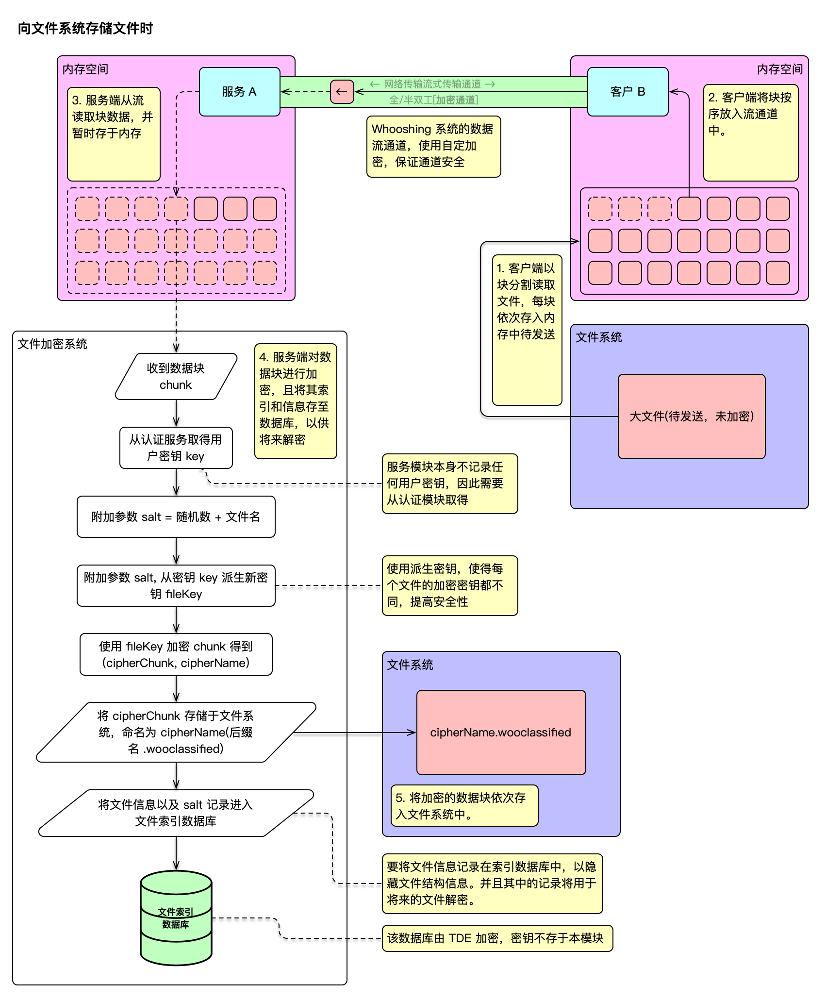
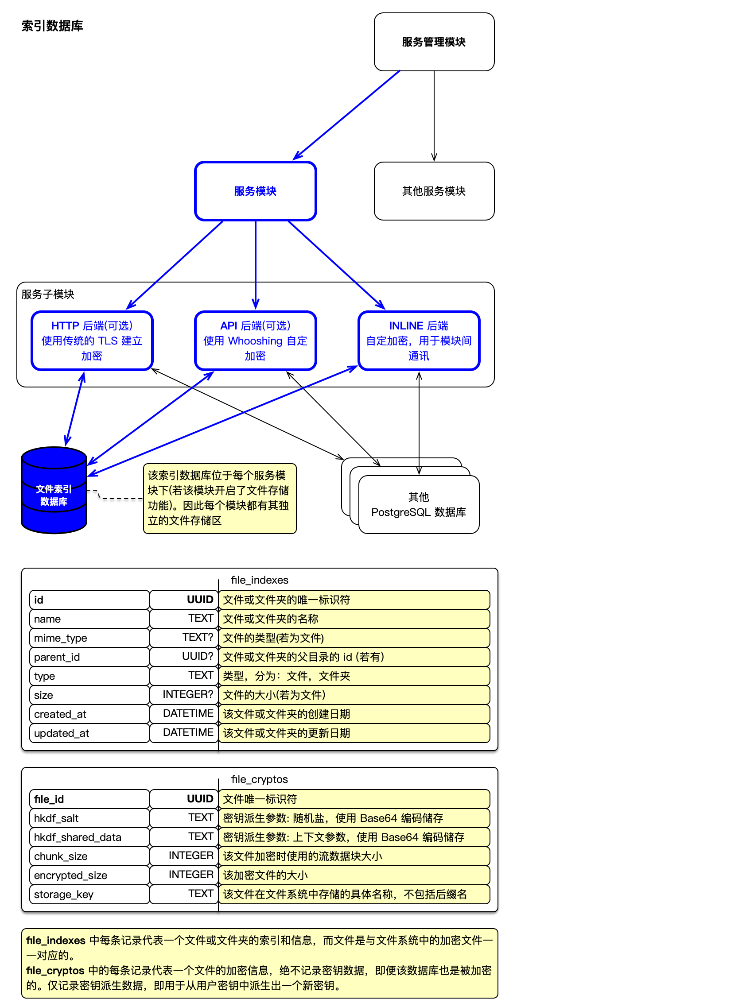

# Whooshing 文件存储依赖库

本项目为 [Whooshing](https://github.com/whooshing-workshop/whooshing) 系统的**文件存储依赖库**，旨在构建一套流式、强安全、隐私保护的文件传输与存储加密系统。契合 [Whooshing](https://github.com/whooshing-workshop/whooshing) 系统，强调模块之间的数据不透明性、文件系统可扩展性，以及对用户数据的零信任加密。


### 特性

- **数据块流式加密**：支持文件分块加密与传输，每一块数据独立加密，增强抗流量分析能力。
- **目录层级隐藏**：使用扁平化索引系统，隐藏真实目录结构，保护文件组织结构隐私。
- **密钥不唯一性**：每个文件派生独立密钥，保障密钥非复用，即使攻击者获取密钥数据库，也无法解密其他文件。
- **服务透明性**：对服务器模块透明，服务端无法读取任何用户数据，仅作为加密数据中转通道。
- **基于模块的密钥获取认证**：服务模块不记录用户密钥，必须通过认证模块授权获取。

----------

### 流程介绍

系统由客户端、服务器、认证模块组成，采用分模块通信和 Whooshing 加密隧道。

1. 客户端从本地读取文件并按块加密。
2. 每块加密数据通过 Whooshing 加密隧道发送至服务端。
3. 服务端临时缓存数据块，供后续文件系统写入使用。
4. 文件元信息与加密参数写入索引数据库。

传输过程中 **TLS 加密**（HTTP）或 **Whooshing 加密隧道**（API、INLINE）确保数据通道安全。


#### 加密机制



#### 索引数据库



-------

### 导入该依赖库

在你的 Package.swift 加入：

``` swift
.package(url: "https://github.com/whooshing-workshop/whooshing.toolbox-file-storage", from: "1.0.8")
```

在依赖模块中引入:

```swift
.product(name: "FileStorage", package: "whooshing.toolbox-file-storage")
```

在需要的地方:

```swift
import FileStorage
```

--------

### 使用介绍

##### 创建和使用 FileStorage 实例:

要获得一个 **FileStorage** 对象，你需要提供一些参数以完成初始化：

``` swift
import NIO
import Cryptos
import Foundation
import FileStorage
import FluentPostgresDriver

// 准备线程，该实例将运行在其上
let pool = MultiThreadedEventLoopGroup(numberOfThreads: System.coreCount)
let eventLoop = pool.next()

// 准备主目录，该文件系统将会将所有的加密文件存于该位置
// 支持相对路径，以及路径修饰符
let storageDir: String = "~/data"

// 准备 PostgreSQL 服务连接参数
// 请修改这些参数以符合你的情况
let postgresConfigure = SQLPostgresConfiguration(
    hostname: "localhost",
    port: 5432,
    username: "postgres",
    password: "password",
    database: "postgres",
    tls: .disable
)

// 准备一个密钥，作为该文件系统的加密主密钥
// 该密钥不会被用于直接加密，而只会使用其派生版本
let keyStr = "Mzn/h5zDnIdi4C3yHaRMG62DhC9qYt8q4SfOCV338hY="
let key = Crypto.Symm.Key(data: Data(base64Encoded: keyStr)!)

// 初始化 FileStorage
let storage = try await FileStorage.new(
    eventLoop: eventLoop,
    storagePath: storageDir,
    dbConfigure: postgresConfigure,
    masterKey: key,
    logger: .init(label: "FileStorage-Testing"),
    debuging: .init(tdeEncrypt: false)  // 仅仅用在调试阶段，生产环境应当移除
).get()
```

> 一旦完成 `FileStorage.new()`，则数据库表结构以及文件主目录都被一次设置完成。你需要保证文件主目录路径是存在的，且数据库连接参数正确，否则会抛出错误

得到该实例后，便可创建目录:

``` swift
// 提供一个路径，目录将会创建在该路径下
// 注意，该路径为虚拟文件系统的路径，详情请见 StoragePath 类型
let path: StoragePath = "testing/example"

// 在指定的路径下创建目录
// 你可以指定 withIntermediateDirectories: 参数为 true 以自动创建中间目录
// 否则，若中间目录不存在，将会抛出错误
let dir = try await storage.createDirectory(at: path)

print(dir.name)                 // <-- print: example
print(dir.path)                 // <-- print: testing/example
print(dir.isExist())            // <-- print: true
```

> 除文件 创建，读，写 外的所有的文件操作都是虚拟操作，并不会操纵文件系统，修改任何数据，仅会更新数据库索引以保持指针正确，因此这些操作非常轻量。

创建文件:

``` swift
// 提供一个路径，文件将会创建在该路径下
// 注意，该路径为虚拟文件系统的路径，详情请见 StoragePath 类型
let path: StoragePath = "testing/example.txt"

// 在指定的路径下创建文件
// 你可以指定 withIntermediateDirectories: 参数为 true 以自动创建中间目录
// 否则，若中间目录不存在，将会抛出错误
let file = try await storage.createFile(at: path)

print(file.name)                // <-- print: example.txt
print(file.mimeType)            // <-- print: MimeType.plain "text/plain"
print(file.path)                // <-- print: testing/example.txt
print(file.size)                // <-- print: 0
print(file.isExist())           // <-- print: true
```

取得目录:
``` swift
// 提供一个路径，获取该路径下的目录
let path: StoragePath = "testing/example"

// 获取目录
let dir = try await storage.getDirectory(at: path)

print(dir.name)                 // <-- print: example
print(dir.path)                 // <-- print: testing/example
print(dir.isExist())            // <-- print: true
```

取得文件:
``` swift
// 提供一个路径，获取该路径下的文件
let path: StoragePath = "testing/example.txt"

// 获取文件
let file = try await storage.getFile(at: path)

print(file.name)                // <-- print: example.txt
print(file.mimeType)            // <-- print: MimeType.plain "text/plain"
print(file.path)                // <-- print: testing/example.txt
print(file.size)                // <-- print: 0
print(file.isExist())           // <-- print: true
```

> 若文件系统无法找到文件，或路径有误，或权限不足，会抛出错误，请合理处理这些错误。FileStorage 系统提供了明确的错误抛出类型，你可以选择使用 Result 处理错误，也可使用传统的 do - catch 方式。


##### 目录操作

得到目录实例后，你可以对其重新命名:
``` swift
let renamedDir = try await dir.rename(as: "images")

print(renamedDir.name)          // <-- print: images
print(renamedDir.path)          // <-- print: testing/images
```

移动目录:
``` swift
// 首先你需要有一个目标目录实例
let destination: Directory = ...

// 将目录移动到目标目录下
let movedDir = renamedDir.move(to: destination)

print(movedDir.path)            // <-- print: <目标目录的路径>/images
```

你可以获取该目录的所有第一层子项目:
``` swift
let items = try await movedDir.subItems()
for item in items {
    if let file = item as? File {
        // 打印出该子文件的信息
        print(file.name)
        print(file.mimeType)
        print(file.path)
        print(file.size)
        print(file.isExist())
    } else if let dir = item as? Directory {
        // 打印出该子目录的信息
        print(dir.name)
        print(dir.path)
        print(dir.isExist())
    }
}
```

获取目录大小:
``` swift
let size = try await movedDir.getSize()

print(size)
```

> 获取目录大小是耗时操作，目录本身并不记录自己的大小。因此，要取得目录大小需要遍历和迭代所有的子项目，并计算大小。

清空目录:

``` swift
// 软清空目录，默认，极其轻量化操作，不会真正删除文件，仅标记为已删除
try await movedDir.empty()
// 或者，硬清空(破坏性操作)，这将直接从数据库及文件系统中彻底删除所有的子项目，且无法撤销
try await movedDir.delete(force: true)
```

删除目录:

``` swift
// 软删除目录，默认，极其轻量化操作，不会真正删除文件，仅标记为已删除
try await movedDir.delete()
// 或者，硬删除(破坏性操作)，这将直接从数据库及文件系统中彻底删除该目录数据，且无法撤销
// 需要注意的是，删除一个文件夹也会删除其所有的子项目，因此请谨慎操作
try await movedDir.delete(force: true)
```

> 尽管 FileStorage 提供软删除的选项，但并不提供恢复选项，要恢复被软删除的文件，需要从数据库重新恢复。因此可以将软删除操作视为用户不可恢复动作。

> **注意**: 使用强制删除前请仔细阅读其后果。


##### 文件操作

得到文件实例后，你可以对其重新命名:
``` swift
let renamedFile = try await file.rename(as: "image.png")

print(renamedFile.name)         // <-- print: image.png
print(renamedFile.mimeType)     // <-- print: MimeType.png "image/png"
print(renamedFile.path)         // <-- print: testing/image.png
```

移动文件:
``` swift
// 首先你需要有一个目标目录实例
// 如何得到一个目录实例，请见 Directory 的详细类型说明
let destination: Directory = ...

// 将文件移动到目标目录下
let movedFile = renamedFile.move(to: destination)

print(movedFile.path)           // <-- print: <目标目录的路径>/image.png
```

删除文件:
``` swift
// 软删除文件，默认，极其轻量化操作，不会真正删除文件，仅标记为已删除
try await movedFile.delete()
// 或者，硬删除(破坏性操作)，这将直接从数据库及文件系统中彻底删除该文件数据，且无法撤销
try await movedFile.delete(force: true)
```

> **注意**: 使用强制删除前请仔细阅读其后果。


##### 文件读写

要对文件进行读写，首先需要打开该文件，以此读取或写入其中的数据，本类型提供:

* 打开文件仅用于读取
* 打开文件仅用于写
* 打开文件可用于读写

打开文件用于只读:
``` swift
// 首先获取文件实例
let file: File = ...

// 打开文件并读取其所有的数据
// 关于 `reader`，请见 `FileReader` 的详细类型说明
let fileData = try await file.withReader { reader in
    reader.readData(part: .all)
}.get()
```

打开文件用于写:
``` swift
// 准备好要写入的数据
let dataToWrite: ByteBuffer = ...

// 打开文件并将数据写入
// 关于 `writer`，请见 `FileWriter` 的详细类型说明
try await file.withWriter { writer in
    writer.write(at: .begin(), bytes: dataToWrite)
}.get()
```

打开文件用于读写:
``` swift
// 准备好要写入的数据
let dataToWrite: ByteBuffer = ...

// 打开文件将数据写入，之后将所有内容读出
// 关于 `readWriter`，请见 `FileReader` 和 `FileWriter` 的详细类型说明
// `FileReadWriter` 即为 `FileReader & FileWriter`
let fileData = try await file.withReadWriter { readWriter in
    readWriter.write(at: .begin(), bytes: dataToWrite).flatMap {
        readWriter.readData(part: .all)
    }
}.get()

// `dataToWrite` 以及 `fileData` 应当是一样的
print(dataToWrite.readableBytes)
print(fileData.readableBytes)
```
你也可以自己控制 Reader Writer 以及 ReadWriter 的生命周期，分别使用这些方法替代即可：

打开一个文件或获取其读句柄
``` swift
let reader = try await file.openForRead()

// 进行一些操作

// 关闭该文件，务必进行此操作，泄漏的文件句柄会引发程序崩溃!
try await reader.close()
```

或只写:
``` swift
let writer = try await file.openForWrite()

// ...

try await writer.close()
```

或读写:
``` swift
let readWriter = try await file.openForReadWrite()

// ...

try await readWriter.close()
```

> 无论是文件读或写操作，都是原子性的，保证要么动作全部完成，要么全部不执行，尽管遇到不可抗事件。

> **注意**: 手动控制 Reader Writer 以及 ReadWriter 的生命周期时，您必须
> 自己在每次完成动作后手动调用 `.close()` 函数，包括出错的时候。因此，你可能需要
> 像以下如此处理读写，确保每次句柄都能正常关闭。
>
> ``` swift
> let readWriter = try await file.openForReadAndWrite()
> do {
>     let res = try await action(readWriter)
> 
>     // 进行你的读写操作
> 
>     try await readWriter.close()
>     return res
> } catch {
>     try? await readWriter.close()
>     throw error
> }
> ```

-------

### 运行环境

* **macOS** (> 11.0)
* **iOS** (> 14.0)
* **Linux** (> 20)
* **Swift** (> 6.0)
* **watchOS** (> 6.0) **[未测试]**
* **tvOS**(> 13) **[未测试]**

-------

### 注意事项

- 使用**强制删除**前请确实知悉其后果
- 文件读写以及文件创建，需要对文件系统进行操作，确保拥有足够的权限

如需了解更多，请参阅各模块内的源码注释与文档说明。

------

### 联系与反馈

如有使用问题或建议，请通过 [GitHub Issues](https://github.com/whooshing-workshop/whooshing.toolbox-file-storage/issues) 提交反馈。

或发至邮箱 [contact@official.whooshings.space](mailto:contact@official.whooshings.space)
